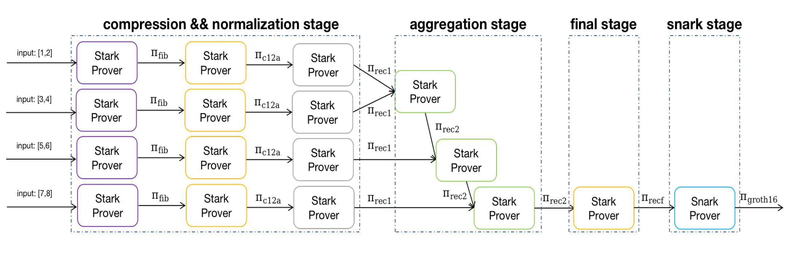

# Prover
The work space is organized as below.
```
basedir/
      _/executor/{task_id}/status
                         _/{task_name}.pil.json
                         _/{task_name}.cm
                         _/{task_name}.const
      _/proof/{task_id}/status
                      _/status.finished
                      _/{task_name}
                      _/batch_proof_{chunk_id}/
                                             _/{task_name}.verifier.circom
                                             _/{task_name}.verifier.zkin.json
                                             _/{task_name}.verifier.r1cs
                                             _/{task_name}.verifier_js/{task_name}.wasm
                                             _/{task_name}.verifier.pil
                                             _/{task_name}.verifier.pil.json
                                             _/{task_name}.verifier.exec
                                             _/{task_name}.verifier.cm
                                             _/{task_name}.verifier.const
                                             _/{task_name}.c12.circom
                                             _/{task_name}.c12.zkin.json
                                             _/{task_name}.c12.r1cs
                                             _/{task_name}.c12_js/{task_name}.wasm
                                             _/{task_name}.c12.pil
                                             _/{task_name}.c12.pil.json
                                             _/{task_name}.c12.exec
                                             _/{task_name}.c12.cm
                                             _/{task_name}.c12.const
                                             _/{task_name}.recursive1.circom
                                             _/{task_name}.recursive1.zkin.json
                                             _/{task_name}.recursive1.r1cs
                                             _/{task_name}.recursive1_js/{task_name}.recursive1.wasm
                                             _/{task_name}.recursive1.cm
                                             _/{task_name}.recursive1.const
                                             _/{task_name}.recursive1.exec
                                             _/{task_name}.recursive1.pil
                                             _/{task_name}.recursive1.pil.json
                      _/{id}_agg/agg_zkin.json
                      _/{id}_agg/agg_proof/
                                         _/{task_name}.recursive2.circom
                                         _/{task_name}.recursive2.zkin.json
                                         _/{task_name}.recursive2.r1cs
                                         _/{task_name}.recursive2_js/{task_name}.recursive2.wasm
                                         _/{task_name}.recursive2.cm
                                         _/{task_name}.recursive2.const
                                         _/{task_name}.recursive2.exec
                                         _/{task_name}.recursive2.pil
                                         _/{task_name}.recursive2.pil.json
                      _/{id}/snark_proof/
                                             _/g16.zkey
                                             _/verification_key.json
                                             _/proof.json
                                             _/public_input.json

```

## Testing
TASK=evm
```bash
FORCE_BIT=21 RUST_MIN_STACK=2073741821 RUST_BACKTRACE=1 RUST_LOG=debug \
    CIRCOMLIB=../executor/node_modules/circomlib/circuits \
    STARK_VERIFIER_GL=../executor/node_modules/pil-stark/circuits.gl \
    STARK_VERIFIER_BN128=../executor/node_modules/pil-stark/circuits.bn128 \
    cargo test --release integration_test -- --nocapture
```
TASK=lr
```bash
FORCE_BIT=21 RUST_MIN_STACK=2073741821 RUST_BACKTRACE=1 RUST_LOG=debug \
    CIRCOMLIB=../executor/node_modules/circomlib/circuits \
    STARK_VERIFIER_GL=../executor/node_modules/pil-stark/circuits.gl \
    STARK_VERIFIER_BN128=../executor/node_modules/pil-stark/circuits.bn128 \
    cargo test --release integration_test_lr -- --nocapture
```
Note that the `FORCE_BIT` can be adjusted as per to different circuits.
Taking Fibonacci as an example, the recursive proof process is shown in the figure below.


